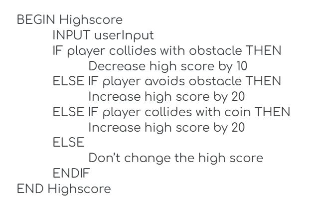
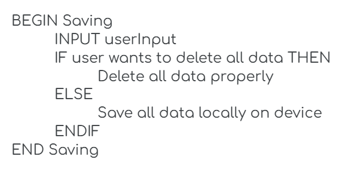

# **Game Design**

## *Identifying and Defining*
### **Identifying a Need**

**Brainstorming**
- A 2D platformer game where the player collects coins, avoids obstacles and reaches an endpoint to complete a quest and must meet a required goal or criteria (eg. needs to collect atleast 10 coins)
- A 2D platformer game where the player navigates through a maze, collects coins and avoids thorns finds an exit
- A text based adventure with python where the player must solve math problems to move their character ahead against other competitors (game will be multiplayer)

**Need:** My game will be designed to improve hand-eye coordination, cognitive development, fine motor skills, and multi-tasking abilities in children between the ages of 5-8. The player must complete a goal or quest in each level by collecting coins, avoiding a variety of obstacles and reaching the endpoint. The game will involve a storyline and progression to keep the audience engaged (eg. the character has to complete different quests in each level), as well as a straightforward goal (collect atleast 5 coins to win this level). Additionally, the game will be simple enough to play and understand without parental assistance, but the difficulty will increase as the player advances through the levels.

**Problem statement:** Children within the ages 5-8 are often energetic and need to be kept engaged throughout the day through various activities. During these years, it is also essential to develop their hand-eye coordination, cognitive development, fine motor skills, and multi-tasking abilities. My 2D platformer game will be simple, have a clear goal, and integrate a storyline to entertain and occupy children while cultivating these necessary skills that they can apply throughout their lives. 

**Skill development:** In order to develop the skills required to create this game in Unity, I will use the video tutorials provided in Google Classroom and possibly other related tutorials on the Internet. 

### **Requirements Outline**

**Inputs:**
- User Inputs:
  - *Keyboard:* Arrow keys for character movement (left, right,), spacebar for jumping
  - *Touchscreen (optional):* Swipe left/right for character movement, tap to jump
  - *Mouse (for navigating):* Click to start the game, choose levels, change settings or exit

**Processing:**
- My program will:
  - Calculate character movement and position based on the arrow keys, spacebar or touch input.
  - Check for collisions with obstacles and collectibles.
  - Adjust the difficulty by increasing the number of obstacles as the player progresses through the levels.
  - Track player's progress and update the game accordingly.

**Outputs:**
- The game will:
  - Display the character's position accurately on the screen as well as the lives remaining, and overall score.
  - Display visual effects when the player collects an item, hits an obstacle and reaches the end of a level.
  - Play sound effects for jumps and will include background music to keep children engaged.

**Transmission:**
No network communication will be required as the game is single-player and doesn't require online support.

**Storage:**
- The game will save:
  - *The player's progress:* Which levels have been completed and the current level. 
  - *The high scores:* The player's highest score for each level will be stored.
  - *Settings:* Any custom settings that the player alters such as sound volume.

### **Functional Requirements**

**User Interaction**
- *Inputs:*
  - Keyboard: Arrow keys for character movement (left and right) and spacebar for jumping
  - Touchscreen (optional): Swipe left or right for movement and tap to jump
- *Actions:*
  - The player will control the main character using the input commands listed above. Pressing left and right arrow keys or swiping will move the character accordingly, while pressing the spacebar or tapping the screen will cause jumps.
  - If the player presses the spacebar while the character is near an collectible or obstacle, the system will check for a collision and update the game on-screen accordingly (e.g. collecting a coin or losing a life).
  - Interacting with the navigation menu will allow the user to start the game, select different levels, adjust settings or exit the game through mouse clicks or touchscreen taps.

**Scoring and Feedback**
- The game will have a point system to calculate the score where players earn points by collecting coins and avoiding obstacles.
- The score and the time taken for completing a level will be displayed at the top corner of the screen and will change in real-time as them player collects items, avoids obstacles and navigates through the level.
- The game will provide visual and auditory feedback for certain actions. For example:
  - Collecting items will trigger a positive sound and a visual effect (eg. animation).
  - Hitting an obstacle (losing a life) or failing a level will trigger a negative sound and a visual cue (eg. "game over" message).
- Once a level has been completed, the player will receive a summary of their performance, including time taken, points earned, coins earned and a congratulatory message if they passed (eg. "You successfully completed this level! Great job!"). If the player failed a level, they will still receive a summary as well as the reason why they didn't pass (eg. "Didn't collect enough coins").

**Level Progression or Simulation Stages**
- The game will have multiple levels that gradually increase in difficulty, as new challenges and obstacles are introduced. 
- Progression:
  - Players advance in the game by reaching the end of a level and completing the given goal successfully
  - Completing the goal will require collecting a set number of coins
- Advancement:
  - After the player completes the goal and reaches the end of a level, they are automatically given the option to move to the next level.
  - The game will display a screen that shows the performance summary along the option to continue, replay the level or exit. 
  - If the level was not completed properly then the player will still be given a performance summary however they will only have the option to retry the level or exit. 

**Saving and Loading Data**
- *User Progress:* The game will automatically save the player's progress after completing each level and record the unlocked levels, the locked levels and the high scores and best times for each unlocked level
- *Settings:* The player's custom settings (such as sound volume and control preferences) will be saved automatically.
- *Storage method:*
  - The data will be stored locally on the user's device, allowing them to resume their game from the last completed level.
  - The saved data can be accessed when the player reopens the game, enabling them to continue without losing any progress.

### **Non-Functional Requirements**

**Performance Requirements**
- The game should load fully within 3 seconds to maintain player engagement and reduce wait times.
- Throughout the gameplay, the system should run efficiently at a frame rate of at least 30 frames per second to ensure fluid animations.
- User inputs (eg. key presses or touch gestures) should be registered instantly, with no noticeable lag. This will enhance the player’s overall experience and ensure the game remains engaging.

**Usability Requirements**
- The game will include a simple and interactive user interface specifically designed for young children (the target audience). By using bright colours and clear icons for easy navigation, parental assistance will not be required. 
- A beginner tutorial will be included at the start of the game and help guide players through the basic controls in a fun and engaging way.
- On-screen prompts will be displayed during the gameplay if the player is stuck (eg. not moving for a certain period of time) to provide assistant (eg. "Press the spacebar to jump!"). This will help children understand the required actions to successfully complete the level without overwhelming them.

**Compatibility Requirements**
- The game will be compatible with both PC and mobile devices (Android and iOS).
- On PC, the game will utilize keyboard and mouse inputs (eg. arrow keys for movement and spacebar for jumping)
- On mobile devices, the game will use touch controls (eg. swiping for movement and tapping to jump).

**Security Requirements**
- The game will not collect personally identifiable information from users and will only focus on game-related data such as high scores, best times and progress.
- All recorded user data will be stored locally on the device to minimise privacy threats and avoid online data transmission.
- User settings, such as sound preferences and control modes, will also be stored locally.
- The game will display a clear privacy policy to all users, which will explain data usage and protection. This will ensure transparency with all players and their guardians.

### **Consideration of Social and Ethical Issues**

Definitions of:
- Equity: The quality of being fair and impartial; justice and fairness
- Accessibility: The quality of being easy to use or obtain; usable easily by everyone

**Accessibility**

Considering that there is a large array of disabilities I belive my game will be suitable for most people. In order to achieve this, I will implement certain features such as customizable controls, subtitles, and visual adjustments to accommodate users with varying disabilities. This approach will encourage inclusivity and also expand the audience for my game, allowing everyone to enjoy the experience.

**Privacy and Data Protection**

Ensuring the privacy of all users and protecting all stored data will be a priority when creating this game. The game will only store and record game-related data (eg. high scores, best times and progress) and no personally identifiable information will be collected. All the acquired data will be stored locally on the user's device to minimise any online threats and risks such as hacking, transmission, etc. The terms and conditions and privacy policy will be shown to all users when they first join ther game. Once they understand this information and give fully informed consent, they be allowed to play the game. Users will also have the option to delete any recorded data at any time througout their experience. 

**Fairness and Representation**

My game will not have any stereotypes or bias towards any gender, race or culture. There will only be one main character and throughout their experience users will be able to customise their character according their personal choices. The scenarios used will be diverse and vary to ensure that there is no discrimation and everyone in represented in a proper manner. This will provide each gender, race and culture with a non-bias representation and will prevent any misunderstandings, also promoting social awareness.

**Mental and Emotional Well-Being**

Users' mental health will be given significant consideration when making this game. To ensure that everyone is fully enjoying the experience, the game will avoid distressing content, excessive violence, and manipulative techniques. Instead, the aim is to create a positive and supportive environment that encourages players to try their best without feeling overwhelmed. Players will also have the option to log off the game at any time and if they choose, they can also get reminders through the game to take regular breaks. 

**Cultural Sensitivities**

In order to respect and acknowledge cultural differences, if there are any culturally related symbols, themes, and narratives included in my game, I will be informed about their meaning and use. This be a measure taken to not offend or misrepresent any groups. This will essential for creating a experience that appreciates the diversity of the audience.

## *Researching and Planning*
### **Exploration of Existing Ideas**

**PMI Table**

### **Flowchart and Pseudocode***

**Pseudocode**

*User interaction*

*Scoring and Feedback*

*Level Progression or Simulation Stages*

*Saving and Loading Data*

**Flowcharts**

*User interaction*

*Scoring and Feedback*

*Level Progression or Simulation Stages*

*Saving and Loading Data*

